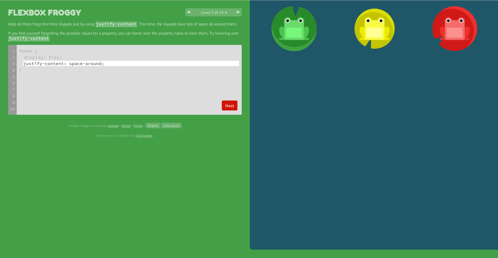
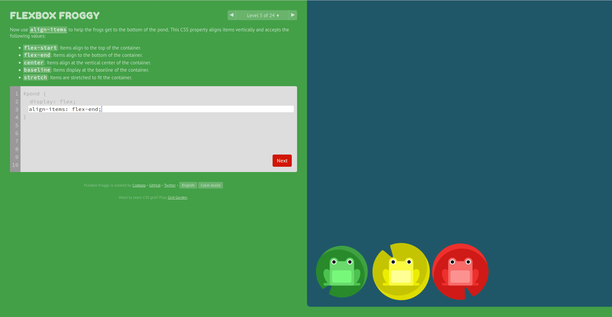
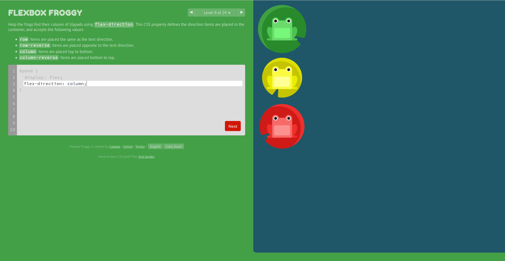
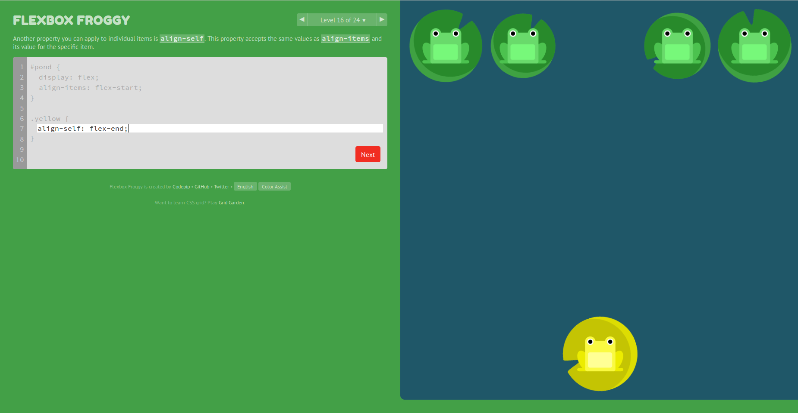
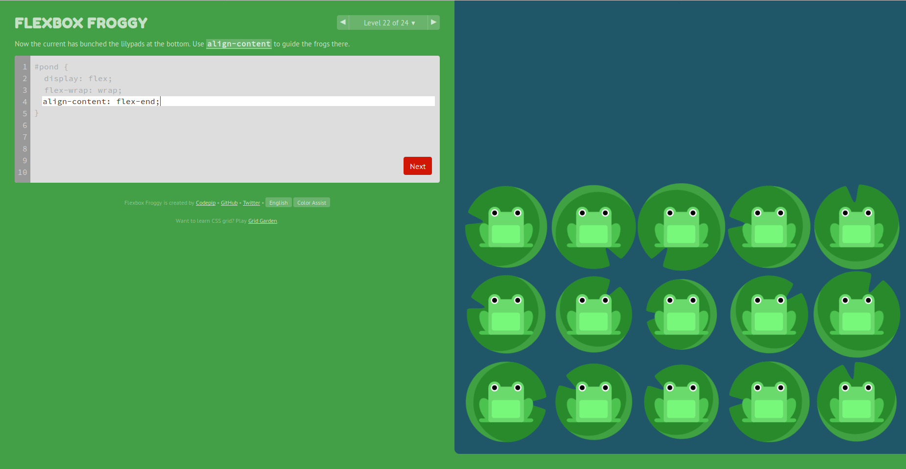
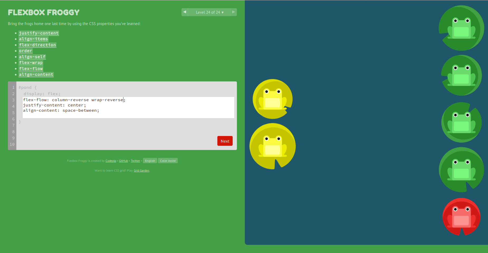

# flex-froggy-solutions

<link rel="stylesheet" href="readme.css">
<link href="https://fonts.googleapis.com/css?family=IBM+Plex+Sans" rel="stylesheet">

<h1>Solutions to Flexbox Froggy<h1>

<h2>1</h2>

<h2>2</h2>

<h2>3</h2>

<h2>4</h2>

<h2>5</h2>

<h2>6</h2>

<h2>7</h2>

<h2>8</h2>

<h2>9</h2>

<h2>10</h2>

<h2>11</h2>

<h2>12</h2>

<h2>13</h2>

<h2>14</h2>

<h2>15</h2>

<h2>16</h2>

<h2>17</h2>

<h2>18</h2>

<h2>19</h2>

<h2>20</h2>

<h2>21</h2>

<h2>22</h2>

<h2>23</h2>

<h2>24</h2>

